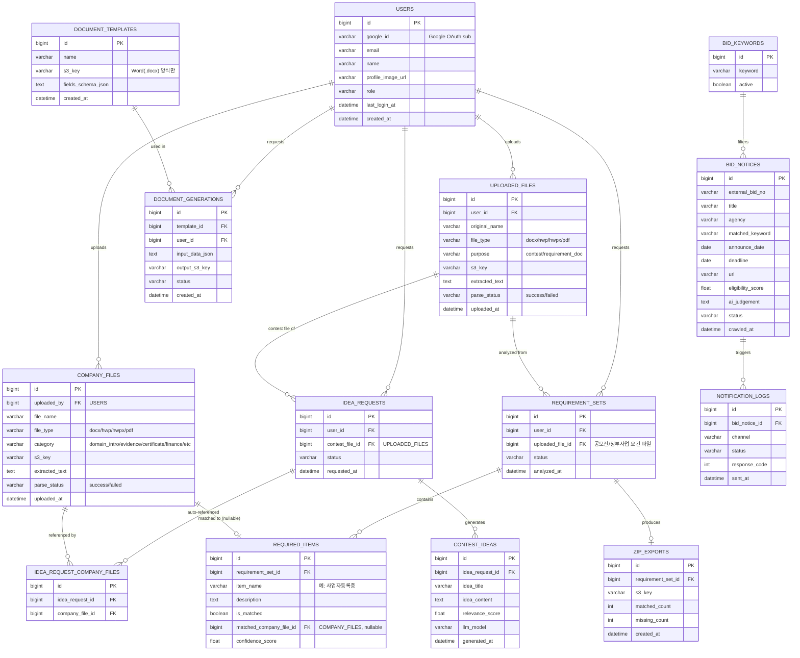

# 업무 자동화 플랫폼 설계서

> 이 문서는 프로젝트 초기 설계를 기록한 것입니다. 실제 구현은 [`../README.md`](../README.md)의 Phase 로드맵을 따라 단계적으로 진행되며, 구현 과정에서 반영된 보정 사항은 맨 아래 [Phase 1 구현 시 반영한 피드백](#phase-1-구현-시-반영한-피드백), [Phase 2~5 구현 시 반영한 피드백](#phase-25-구현-시-반영한-피드백), [후속 변경사항](#후속-변경사항-아이디어-제거--나라장터-알림-방식-변경--자료실-업로드-버그-수정) 절을 참고하세요. **아이디어 제안 기능은 현재 제거되어 있습니다** — 아래 두 절이 각각 도입/제거 이유를 담고 있습니다.

---
## 0. 기술 스택 제안 (결론부터)

**"Spring Boot(핵심 서비스) + Python/FastAPI(AI·문서·크롤링 엔진) + React" 하이브리드 구조**를 제안합니다.

| 후보 | 장점 | 단점 | 채택 여부 |
|---|---|---|---|
| Spring Boot 단독 | 이력서 핵심 스택, 구조화·유지보수 용이 | LangChain류 AI 생태계 빈약, RAG/문서파싱 라이브러리가 Python 대비 부족 | 부분 채택 |
| Python(FastAPI) 단독 | AI/RAG/문서파싱(python-docx, pandas, 임베딩) 압도적으로 유리, 나라장터 자동화는 이미 검증된 코드 재사용 가능 | 대규모 서비스향 계층 구조/트랜잭션 관리 경험이 Spring 대비 약함, 이력서에 Spring 강점이 묻힘 | 부분 채택 |
| **Spring Boot + FastAPI 혼합** | 지원자 강점(Spring/JPA)과 AI 실무 경험(Python 나라장터 자동화)을 **포트폴리오에서 동시에** 보여줄 수 있음. 관심사 분리(비즈니스 로직 vs AI/크롤링 로직) | 서버 2개 운영 부담 | **채택** |

**이유**
- 이력서 기준 실무 경험이 검증된 4번 기능(나라장터+Claude AI+Google Chat, ThreadPoolExecutor 병렬화)은 Python으로 그대로 재사용하는 것이 리스크가 가장 낮습니다.
- 1·3번 기능(아이디어 제안, 적격증빙자료 매칭)은 임베딩·RAG 성격이 강해 Python 생태계(langchain, sentence-transformers 등)가 훨씬 빠르게 구현됩니다.
- 2번(문서 자동 채우기)은 `python-docx`가 표준이라 Python이 유리합니다.
- 반면 **회원/권한관리, 도메인 트랜잭션, 전체 API 게이트웨이, 스케줄링 오케스트레이션**은 원하시는 대로 Spring Boot(JPA/Security)로 구성해 이력서 강점을 살립니다.
- 신입/인턴 포트폴리오 난이도로도 "폴리글랏 마이크로서비스"는 과하지 않고 오히려 면접에서 설명하기 좋은 구조입니다. (k8s·MSA 풀스택까지는 가지 않고, EC2 한 대에 두 프로세스를 올리는 실용적 수준으로 제한)

**⚠️ 한글(HWP) 파싱 관련 유의사항**
- `.hwp`(구버전)는 `pyhwp`(hwp5txt)로 텍스트 추출이 가능하지만, `.hwpx`(최신 XML 기반)는 자체 zip+xml 구조라 별도 파서가 필요합니다(예: `hwpx-parser` 계열 오픈소스 또는 zip 내부 `Contents/section0.xml`을 직접 파싱).
- 완벽한 서식 보존이 목적이 아니라 "텍스트 추출 → LLM 분석"이 목적이므로, 100% 렌더링 대신 텍스트만 안정적으로 뽑아내는 데 집중하면 구현 난이도가 크게 낮아집니다.
- 파싱 실패율을 낮추기 위해 파일 업로드 시 포맷을 자동 판별하고, 파싱 실패 시 사용자에게 "PDF로 변환 후 재업로드" 안내를 띄우는 폴백 처리를 권장합니다.

---
## 1. 전체 아키텍처 (계층형)

```
┌─────────────────────────────────────────────────────────┐
│  Presentation Layer (React SPA, Vite)                    │
│  - 로그인(Google 버튼) / 메인 대시보드(메뉴) / 회사 자료실  │
│  - 4개 기능 화면, 공통 Layout/Nav                          │
└───────────────────────▲───────────────────────────────────┘
                         │ REST(JSON) / Google OAuth2 + 자체 세션 JWT
┌───────────────────────┴───────────────────────────────────┐
│  API Gateway / Controller Layer (Spring Boot)             │
│  - OAuth2LoginController(Google), IdeaController,          │
│    DocumentController, EvidenceController, BidController,  │
│    CompanyFileController(자료실)                            │
└───────────────────────▲───────────────────────────────────┘
                         │
┌───────────────────────┴───────────────────────────────────┐
│  Service Layer (Spring Boot)                               │
│  - 트랜잭션/도메인 로직, 스케줄러(나라장터 주기 실행 트리거) │
│  - 각 서비스는 필요 시 AI Engine Client 호출                │
└───────┬───────────────────────────────────────────▲────────┘
        │ 내부 REST 호출 (WebClient)                 │
┌───────▼───────────────────────────────────────────┴────────┐
│  AI/Automation Engine (Python, FastAPI) - 내부 전용 서버     │
│  - /files/parse       : 업로드 파일(docx/hwp/pdf) 텍스트 추출│
│  - /ideas/generate    : 공모전 파일×자료실 도메인문서 분석    │
│  - /documents/fill    : Word(docx) 템플릿 자동 채움           │
│  - /evidence/match    : 요건 파일 분석→자료실 증빙 매칭+ZIP  │
│  - /bids/scan         : 나라장터 조회+AI 적격판단(재사용)    │
│  - LLM Client(Claude API), Embedding, File Parser            │
│    (python-docx / pyhwp / pdfplumber), zipfile, requests    │
└───────┬───────────────────────────────────────────▲────────┘
        │ JDBC/JPA                                    │ psycopg
┌───────▼───────────────────────────────────────────▼────────┐
│  Data Access Layer                                          │
│  - PostgreSQL (RDS or EC2 내 설치)                           │
│  - AWS S3 (원본 문서, 생성 문서, 템플릿 파일 저장)            │
└───────────────────────────────────────────────────────────┘
                         │
┌───────────────────────▼───────────────────────────────────┐
│  External Integration                                       │
│  - 나라장터 Open API, Claude API, Google Chat Webhook        │
└───────────────────────────────────────────────────────────┘
```

**핵심 원칙**
- React는 오직 Spring Boot API만 바라봄 (Python 서버는 외부 노출 X, 내부망/localhost 통신 또는 EC2 내부 포트로만 접근 → 보안 단순화).
- Spring Boot는 "오케스트레이션 + 인증 + 영속성"만 담당, 무거운 AI 연산은 전부 Python으로 위임 → 두 언어의 책임을 명확히 분리.
- 나라장터 자동 스캔은 Spring `@Scheduled`가 매일 정해진 시각에 Python `/bids/scan`을 트리거하는 방식(이력서의 "정해진 시각 알림 전송" 경험 그대로 확장).

---
## 2. AWS EC2 배포 구조

```
[Route53] → [EC2 1대 (t3.small~medium, Ubuntu)]
   ├─ Nginx (Reverse Proxy, 443 SSL - Let's Encrypt)
   │    ├─ /            → React 정적 빌드 (Nginx가 직접 서빙)
   │    ├─ /api/**       → Spring Boot (systemd, :8080)
   │    └─ (내부 전용)    → FastAPI (:8000, 외부 미노출, Spring만 접근)
   ├─ PostgreSQL (초기: EC2 내 설치, 트래픽 늘면 RDS로 분리)
   └─ systemd 서비스 2개: allforland-api.service / allforland-ai.service
             ↓
        [S3 Bucket] 문서/템플릿 저장
        [CloudWatch] 로그/알람 (선택)
```

- 초기 단계는 **RDS/ALB 없이 EC2 단일 인스턴스**로 비용을 최소화하고, 트래픽이 늘어나면 DB만 RDS로 분리하는 단계적 확장을 권장합니다(신입 포트폴리오 수준에 적합, 이력서에 "비용 효율적 단계적 확장 설계"로 어필 가능).
- Nginx가 정적 React 빌드물을 서빙 + `/api`는 Spring Boot로 프록시.
- FastAPI는 `127.0.0.1:8000`만 바인딩하여 외부 접근 원천 차단(보안).

---
## 3. ERD (예상 테이블 설계)



**설계 포인트**
- `USERS`는 비밀번호 컬럼이 없습니다. `google_id`(OAuth `sub` 클레임)로 식별하며, 최초 Google 로그인 시 자동 회원가입(Provisioning)됩니다.
- **`COMPANY_FILES`가 이번 변경의 핵심**입니다. "회사 관련 자료"는 전부 이 표 하나로 들어가는 단일 자료실이며, `category`로 용도를 구분합니다(도메인소개서/증빙서류/재무자료 등, 다중 태그가 필요하면 별도 태그 테이블로 확장 가능).
  - 1번 기능(아이디어 제안): 사용자는 **공모전 파일만** 업로드하면 되고, 서버가 `COMPANY_FILES(category='domain_intro')`를 자동 조회해 LLM 프롬프트에 포함합니다. `IDEA_REQUEST_COMPANY_FILES`는 "그 요청 시점에 실제로 어떤 자료실 파일들이 참고되었는지"를 기록하는 감사(audit)/재현용 스냅샷 테이블로, 사용자가 직접 선택하는 UI가 아닙니다.
  - 3번 기능(증빙자료 매칭): `REQUIRED_ITEMS.matched_company_file_id`가 `COMPANY_FILES(category='evidence')`를 가리키며, 마찬가지로 사용자가 매번 올릴 필요가 없습니다.
- `UPLOADED_FILES`는 "이번 한 번의 요청에만 쓰이는 임시성 파일"(공모전 공고문, 정부사업 요건 파일)만 남기고, 회사 관련 자료는 전부 `COMPANY_FILES`로 이관했습니다.
- `BID_NOTICES`/`NOTIFICATION_LOGS`는 이력서에 이미 있는 나라장터 자동화 스키마를 정규화한 것.

> Phase 1 구현에서는 이 ERD 전체가 아니라 `USERS`, `COMPANY_FILES`만 실제로 생성합니다. 나머지 테이블은 각 기능이 구현되는 Phase에서 추가됩니다. 이유는 문서 하단 피드백 절 참고.

---
## 4. 기능별 핵심 흐름

### 0-1) 로그인 (Google 간편로그인 전용)
```
[React] "Sign in with Google" 버튼 클릭
   → Spring Security OAuth2 Client → Google OAuth2 인증 화면으로 리다이렉트
   → 사용자 동의 → Google이 authorization code를 Spring 콜백(/login/oauth2/code/google)으로 전달
   → Spring: 코드로 액세스 토큰 교환 → 사용자 프로필(email, name, sub, picture) 획득
   → USERS 테이블에 google_id로 조회, 없으면 자동 생성(최초 로그인 = 자동 가입)
   → Spring이 자체 세션 JWT 발급 → React는 이후 모든 API 호출에 Authorization 헤더로 사용
   → React: 메인 대시보드로 이동
```
> 회원가입/비밀번호 찾기/이메일 인증 같은 절차가 전부 사라져 구현 범위가 크게 줄어듭니다. 필요하면 `hd`(hosted domain) 파라미터로 특정 회사 Google Workspace 도메인 계정만 로그인 허용하도록 제한할 수 있습니다.

> Phase 1 구현 보정: 세션 JWT는 React가 헤더로 직접 다루지 않고, Spring이 **httpOnly + Secure + SameSite=Lax 쿠키**로 발급합니다. 흐름 자체는 동일하되 XSS 시 토큰 탈취 위험을 낮춥니다.

### 0-2) 메인 페이지 (기능 허브)
```
로그인 완료 → GET /api/dashboard/summary (Spring)
  → 4개 기능 카드에 최신 현황 표시
    (예: "이번 주 매칭된 공모전 3건", "미처리 나라장터 공고 2건")
→ 카드 클릭 시 해당 기능 라우트로 이동 (SPA 라우팅, 리로드 없음)
→ 상단 네비게이션에 "회사 자료실" 별도 메뉴로 상시 접근 가능
```

### 0-3) 회사 자료실 (단일 업로드 페이지)
```
[React] 자료실 페이지 → 파일 드래그앤드롭 업로드(docx/hwp/pdf, 다중 선택 가능)
   → POST /api/company-files/upload (Spring, multipart)
   → Spring: S3 저장 → COMPANY_FILES row 생성(category는 업로드 시 드롭다운으로 선택: 도메인소개/증빙서류/재무자료/기타)
   → Spring → FastAPI POST /files/parse → extracted_text 저장
   → (category='evidence'인 경우) FastAPI가 즉시 임베딩까지 생성해 벡터 인덱스에 등록
   → React: 자료실 목록 화면에 카테고리별 파일 리스트 표시(검색/필터/삭제 가능)
```
> 이 페이지 하나로 "1번 기능이 참고하는 회사 도메인 자료"와 "3번 기능이 매칭하는 증빙 원본"을 통합 관리합니다. 사용자는 최초 1회(또는 자료 갱신 시에만) 이 페이지에 업로드해두면, 이후 1·3번 기능에서는 별도로 회사 자료를 다시 올릴 필요가 없습니다.

> Phase 1 구현 보정: S3 대신 로컬 디스크에 저장하는 `FileStorageService` 구현체를 사용합니다(AWS 자격증명이 아직 없기 때문). 임베딩/벡터 인덱스 등록은 3번 기능이 구현되는 Phase에서 추가됩니다.

### 1) 공모전 파일 업로드 → 자료실 도메인정보 자동 참조 → 아이디어 제안
```
[React] 공모전 파일 업로드(docx/hwp/pdf) — 회사 자료는 업로드하지 않음(자료실에서 자동 조회)
   → POST /api/files/upload (Spring, multipart) → S3 저장 → Spring → FastAPI POST /files/parse
   → FastAPI: 확장자별 파서 분기
        .docx → python-docx / .pdf → pdfplumber(or PyMuPDF) / .hwp → pyhwp / .hwpx → hwpx 파서
   → 추출 텍스트를 UPLOADED_FILES.extracted_text에 저장(parse_status 기록)
   ────────────────────────────────────────
   → POST /api/ideas/generate { contest_file_id } (Spring)
   → Spring: IDEA_REQUESTS 생성
   → Spring: COMPANY_FILES에서 category='domain_intro'인 최신 파일들을 자동 조회
             → IDEA_REQUEST_COMPANY_FILES에 스냅샷 기록(감사/재현용)
   → Spring → FastAPI POST /ideas/generate { contest_text, company_domain_texts[] }
   → FastAPI: 프롬프트 구성(공모전 요건 vs 회사 강점) → Claude API 호출
   → 결과(아이디어 제목/내용/적합도 점수 JSON) 반환
   → Spring: CONTEST_IDEAS 저장 → React에 카드 형태로 렌더링
```
> 사용자 입력이 "공모전 파일 1개"로 단순화됩니다. 자료실에 회사 자료가 하나도 없으면 React가 "먼저 자료실에 회사 소개자료를 등록해주세요" 안내와 함께 자료실 페이지로 유도합니다.

> **Phase 4에서 구현했다가 이후 사용자 요청으로 제거함.** 구현 자체는 설계서대로(위 흐름 + `IDEA_REQUEST_COMPANY_FILES` 스냅샷 포함) 동작했으나, 아이디어 제안 기능 자체를 없애달라는 요청을 받아 관련 코드를 전부 삭제했습니다. 상세는 문서 맨 아래 [후속 변경사항](#후속-변경사항-아이디어-제거--나라장터-알림-방식-변경--자료실-업로드-버그-수정) 참고.

### 2) 문서 자동 채우기 (Word 양식 전용, 회사 고정정보는 자료실에서 자동 채움)
```
[사전 등록] 관리자가 Word(.docx) 양식 업로드 → DOCUMENT_TEMPLATES 저장
   (템플릿 안 채움 항목은 {{항목명}} 같은 플레이스홀더로 사전 표시,
    회사명/사업자번호/대표자 등 "고정 정보"는 fields_schema_json에 auto=true로 표시)
[실행 흐름]
[React] 템플릿 선택 → 폼에는 이번 건에만 해당하는 항목만 입력(회사 고정정보 입력란은 자동으로 숨김/사전 채움)
   → POST /api/documents/generate (Spring)
   → Spring: DOCUMENT_TEMPLATES에서 s3_key로 원본 .docx 템플릿 조회
   → Spring: fields_schema_json에서 auto=true인 항목은 COMPANY_FILES(category='domain_intro'/'certificate') 텍스트에서
             FastAPI LLM 추출로 값 확보(예: 사업자등록번호, 대표자명, 주소)하여 field_values에 자동 병합
   → Spring → FastAPI POST /documents/fill { template_s3_key, field_values }
   → FastAPI: python-docx로 플레이스홀더 치환(표/문단 모두 지원) → 결과 파일 S3 업로드
   → FastAPI: 업로드된 s3_key 반환 → Spring: DOCUMENT_GENERATIONS 기록
   → React: 다운로드 링크 + "자동으로 채워진 항목" 표시(사용자가 검토 후 필요시 수정 가능)
```
> 다른 포맷(한글/PDF)은 "양식"으로 직접 채워 넣기엔 구조상 까다로워, 자동 채우기는 Word 양식만 지원하는 것으로 범위를 명확히 좁혔습니다. (한글 양식이 꼭 필요하면 이후 별도 과제로 확장)

> **Phase 3에서 구현 완료.** S3 대신 로컬 스토리지를 사용하는 것 외에는 흐름 동일. LLM 자동추출이 실패해도 해당 필드만 빈 채로 남기고 전체 요청은 실패시키지 않습니다.

### 3) 공모전/정부사업 요건 파일 → 자료실 증빙자료 자동 매칭 & ZIP 생성
```
[사전 조건] 회사 자료실(0-3)에 category='evidence'로 증빙자료가 미리 등록되어 있음
   (신규 등록 시 FastAPI가 텍스트 추출 + 임베딩하여 벡터 인덱스에 자동 반영 → 3번 기능에서 별도 준비 불필요)
[실행 흐름]
[React] 공모전/정부사업 공고문 파일 업로드(docx/hwp/pdf) — 증빙자료는 업로드하지 않음
   → /files/upload → /files/parse (1번과 동일 파서 재사용)
   → POST /api/evidence/analyze { uploaded_file_id } (Spring)
   → Spring: REQUIREMENT_SETS 생성
   → Spring → FastAPI POST /evidence/match { requirement_text }
   → FastAPI 처리:
       1) LLM으로 공고문에서 "제출서류 목록" 추출 (예: 사업자등록증, 국세납세증명서, 실적증명서 …)
          → REQUIRED_ITEMS 각 행 생성
       2) 항목별로 COMPANY_FILES(category='evidence') 벡터 인덱스에서 유사도 검색 → 가장 근접한 문서 매칭
       3) confidence_score가 임계치 이상이면 is_matched=true, matched_company_file_id 기록
       4) 임계치 미만/미발견 항목은 is_matched=false로 남김 (= "부족한 자료" 목록)
       5) is_matched=true인 자료실 파일들을 모아 zipfile로 압축 → S3 업로드 → ZIP_EXPORTS 기록
   → Spring: 결과(매칭 zip 다운로드 링크 + 부족 항목 리스트) 반환
   → React:
       - "자동으로 준비된 서류 (n건)" → ZIP 다운로드 버튼
       - "부족한 자료 (m건)" → 항목명 + 사유(예: "실적증명서에 해당하는 문서를 찾지 못했습니다") 리스트로 안내
         (필요 시 이 화면에서 바로 "자료실에 업로드하기" 버튼으로 0-3 페이지로 이동해 보완 가능)
```

> **Phase 5에서 구현 완료 — 단, 벡터 인덱스는 pgvector/FAISS가 아니라 단순 코사인 유사도로 구현.** 임베딩도 Claude API가 아니라 로컬 sentence-transformers 사용. zip 압축은 Spring이 직접 담당(파일이 이미 Spring 쪽 로컬 스토리지에 있으므로). 상세 이유는 문서 하단 참고.

### 4) 나라장터 자동화 → Slack 알림 (기존 경험 재사용/고도화)
```
[스케줄러] Spring @Scheduled(cron="매일 지정 시각")
   → FastAPI POST /bids/scan 트리거
   → FastAPI:
       1. BID_KEYWORDS 조회 (Spring이 활성 키워드만 전달)
       2. 나라장터 Open API 조회 후 키워드로 제목 필터링
       3. 신규 공고만 필터링 → Claude API로 적격 여부/점수를 ThreadPoolExecutor로 병렬 판단
          (rate limit 고려해 동시 실행 수 제한 - 기존 경험 그대로)
       4. 기준 점수 이상 → Slack Webhook으로 알림 전송
       5. 결과를 Spring에 반환 → Spring이 BID_NOTICES/NOTIFICATION_LOGS에 저장(외부공고번호로 중복 방지)
   → Spring: 결과 집계 → React 대시보드에 "오늘 감지된 공고" 표시
```

> **Phase 2에서 구현 완료.** 나라장터 API가 키워드 기반 검색이 아니라 날짜범위 목록 조회 방식이라, "키워드별 병렬 조회" 대신 "목록 조회 1회 + 제목 키워드 매칭 후 Claude 판단만 병렬화"로 조정했습니다. 알림 채널은 Google Chat 대신 Slack.

---
## 5. 기능 구현 상세

### 5.1 Spring Boot 패키지 구조 (계층형)
```
com.allforland.automation
 ├─ controller   (Idea, Document, Evidence, Bid, CompanyFile, Auth, Dashboard)
 ├─ service      (동일 도메인별 Service + Impl)
 ├─ client       (AiEngineClient - WebClient로 FastAPI 호출 wrapping)
 ├─ repository   (Spring Data JPA)
 ├─ domain       (Entity)
 ├─ dto          (Request/Response)
 ├─ scheduler    (BidScanScheduler)
 ├─ config       (SecurityConfig[OAuth2 Client], WebClientConfig, S3Config)
 └─ common       (예외처리, ApiResponse 공통 포맷)
```

### 5.2 FastAPI 모듈 구조
```
ai_engine/
 ├─ main.py
 ├─ routers/ (files.py, company_files.py, documents.py, evidence.py, bids.py, embeddings.py)
 ├─ services/
 │    ├─ file_parser/
 │    │     ├─ docx_parser.py   (python-docx)
 │    │     ├─ pdf_parser.py    (pdfplumber / PyMuPDF)
 │    │     └─ hwp_parser.py    (pyhwp / hwpx 자체 파서)
 │    ├─ llm_client.py          (Claude API 래퍼, JSON 파싱까지 포함)
 │    ├─ embedding_service.py   (로컬 sentence-transformers — pgvector/FAISS 아님, 아래 Phase 2~5 절 참고)
 │    ├─ docx_filler.py         (python-docx, Word 양식 채움)
 │    ├─ requirement_extractor.py (evidence.py 라우터 안에 통합 — 별도 파일로 분리하지 않음)
 │    └─ bid_scanner.py         (나라장터 조회 + 고정 10시~10시 윈도우 계산, 기존 로직 이식)
 └─ core/config.py
```
(`ideas.py`, `slack_notifier.py`는 후속 변경으로 삭제됨 — 아래 [후속 변경사항](#후속-변경사항-아이디어-제거--나라장터-알림-방식-변경--자료실-업로드-버그-수정) 참고)
> zip 압축은 FastAPI가 아니라 Spring이 담당합니다(파일이 이미 Spring 로컬 스토리지에 있어 왕복 전송이 불필요하므로) — 별도 `zip_builder.py`는 없습니다. `core/s3.py`도 아직 S3를 쓰지 않아 없습니다.

### 5.3 인증/보안
- **Spring Security OAuth2 Client (Google) 전용 로그인** — 자체 회원가입/비밀번호 로그인 폼 없음
- 최초 로그인 시 `USERS` 자동 provisioning(google_id, email, name, profile_image 저장), 이후 재로그인 시 매칭
- 필요 시 `hd`(hosted domain) 파라미터 또는 로그인 성공 후 이메일 도메인 검증으로 특정 회사 도메인 계정만 허용
- 로그인 성공 후 Spring이 자체 세션 JWT를 발급해 React가 이후 API 호출에 사용(Google 액세스 토큰을 그대로 프론트에 노출하지 않음) — **Phase 1 구현에서는 httpOnly 쿠키로 전달**(위 0-1 보정 참고)
- FastAPI는 Spring에서만 호출되는 내부 서버 → API Key 헤더 정도의 최소 인증만 추가
- S3 접근은 IAM Role(EC2 Instance Profile)로 처리, 액세스키 하드코딩 금지
- Google OAuth Client ID/Secret, JWT secret은 Spring `application-local.yml`에, Claude API Key·나라장터 키·Slack Webhook URL은 `ai-engine/.env`에 보관합니다(관심사 분리 원칙에 따라 Spring은 AI/외부 API 키를 직접 갖지 않습니다). 전부 git 미포함.

### 5.4 성능 고려사항
- 나라장터/AI 판단: 기존 검증된 `ThreadPoolExecutor` 병렬화 그대로 재사용 (88초→13초 경험 확장)
- 임베딩 검색은 매번 재계산하지 않도록 COMPANY_FILES 업로드 시점(자료실)에 1회 임베딩 → 인덱스 캐싱
- Spring ↔ FastAPI 호출은 WebClient 비동기 + 타임아웃 설정으로 블로킹 방지
- 대용량 문서 업로드/다운로드는 Spring이 직접 스트리밍하지 않고 S3 Presigned URL 방식으로 클라이언트가 직접 업/다운로드하도록 하여 서버 부하 감소

---
## 6. UI/UX 설계

**디자인 톤(Phase 1부터 all4land.com 참고로 보정됨):** 딥 네이비 배경 + 오프화이트 텍스트, 굵은 산세리프 대형 헤드라인, 얇은 상단 내비게이션(로고 + 최소 메뉴 + 프로필), 매출/인원/사업수 스타일의 굵은 스탯 카운터, 구분자로 얇은 헤어라인 사용. (원래 설계서 초안의 "세리프 헤드라인 + 노이즈 텍스처" 톤에서, 실제 참고 대상 서비스의 톤에 맞춰 보정 — 로고·사진·문구는 그대로 쓰지 않습니다.)

### 로그인 페이지
- 전체 화면 다크 네이비 배경(은은한 그라데이션)
- 중앙에 로고 + 캐치프레이즈 한 줄
- 버튼은 **"Sign in with Google" 단 하나만** — 얇은 보더 + 옅은 배경의 미니멀 버튼
- 회원가입/비밀번호 찾기 등 부가 UI 없음

### 메인 페이지 (기능 허브)
- 상단 얇은 네비게이션: 로고 — ~~`아이디어 / `~~`문서 / 증빙 / 나라장터 / 자료실`(아이디어 제거됨) — 사용자 프로필(Google 프로필 이미지) / 로그아웃
- 히어로 영역: 대형 헤드라인, 스크롤/hover 시 미세한 트랜지션
- 본문: ~~4개~~ **3개**의 대형 카드(타일) 그리드(아이디어 제거로 조정, PC 기준 3열) — hover 시 미세한 확대(scale 1.02) + 하단에 "Access —" 텍스트 노출
- 각 카드에 실시간 요약 배지(예: "신규 공고 2건") 삽입
- "회사 자료실"은 기능 카드와 별도로 상단 네비게이션 아이콘(문서함 아이콘)으로 상시 노출

### 회사 자료실 페이지
- 좌측: 카테고리 필터(전체/도메인소개/증빙서류/재무자료/기타) — 얇은 세로 탭
- 중앙: 드래그앤드롭 업로드 영역
- 하단: 파일 리스트(파일명, 카테고리 배지, 업로드일, 파싱 상태, 삭제 버튼)
- **업로드 대상 카테고리는 별도 선택창이 아니라 왼쪽 필터 탭과 동일한 상태를 공유합니다** — 처음엔 업로드용 `<select>`를 따로 뒀는데 목록 필터 탭과 별개로 동작해 혼란을 줘서(업로드가 항상 마지막으로 select에 남아있던 카테고리로만 들어가는 것처럼 보임) 제거했습니다. "전체" 탭에서는 업로드 영역 대신 "카테고리를 먼저 선택하세요" 안내가 표시됩니다.

### 하위 기능 페이지
- 동일한 다크 톤 + 상단 네비 유지, 좌측에 폼/입력 영역, 우측에 결과 카드 리스트 → 톤 일관성 유지
- 문서/증빙 페이지는 실제 결과가 표시됩니다. 나라장터 페이지는 결과 카드 리스트 대신 **어제 10시~오늘 10시 윈도우의 적격 공고 목록**을 보여줍니다.

### 프론트 구조
```
src/
 ├─ pages/ (Login, Dashboard, CompanyFilesPage, DocumentPage, EvidencePage, BidPage)
 ├─ components/ (Layout, Nav, FeatureCard, ResultCard, LoadingText, FileUploader)
 ├─ api/ (axios instance, 기능별 api 모듈)
 └─ styles/ (디자인 토큰: color, typography 변수)
```
- Tailwind CSS + 커스텀 디자인 토큰으로 다크 네이비 톤 구현

---
## 7. 권장 개발 순서 (난이도 기반 로드맵)

1. **Phase 1 (기반)**: Spring Boot + Google OAuth2 로그인 + React 레이아웃/메인 페이지 + **회사 자료실 페이지**(업로드/파싱까지) 우선 완성 — 이후 모든 기능의 전제조건이므로 가장 먼저 견고하게 구축 ✅ **구현 완료**
2. **Phase 2 (재사용)**: 4번 나라장터 자동화 — 기존에 만든 Python 로직을 FastAPI 엔드포인트로 이식 (가장 리스크 낮음, 가장 먼저 완성 가능) ✅ **구현 완료**
3. **Phase 3**: 2번 문서 자동 채우기 (python-docx는 난이도 낮음, 자료실 연동 자동 채움은 이후 고도화) ✅ **구현 완료**
4. **Phase 4**: 1번 아이디어 제안 (자료실 자동 참조 + LLM 프롬프트 설계, 구현 난이도 중간) ⛔ **구현 후 사용자 요청으로 제거됨**
5. **Phase 5**: 3번 적격증빙자료 매칭 (임베딩/벡터 검색 — 4개 기능 중 난이도 최상, 마지막에 배치해 학습 곡선 확보) ✅ **구현 완료** (벡터 검색은 코사인 유사도로 단순화 — 아래 피드백 절 참고)
6. **Phase 6**: EC2 배포, Nginx/systemd 설정, 도메인 연결, HTTPS 적용, Google OAuth Redirect URI 운영 도메인으로 등록 — *아직 진행 전, 로컬 검증 후 진행 예정*

---
## Phase 1 구현 시 반영한 피드백

초안 대비 아래 사항을 보정하여 구현했습니다. 어떤 기능도 흐름 자체는 바뀌지 않았습니다.

1. **세션 토큰 저장 방식**: `Authorization` 헤더 대신 `httpOnly + Secure + SameSite=Lax` 쿠키로 발급 — React JS가 토큰 값에 접근할 수 없어 XSS로 인한 세션 탈취 위험을 낮춥니다.
2. **DB 스키마 점진적 생성**: 전체 ERD(9개 테이블)를 한 번에 만들지 않고, Phase 1에 실제로 쓰이는 `USERS`, `COMPANY_FILES`만 우선 생성. 나머지는 해당 기능이 구현되는 Phase에서 추가합니다.
3. **스토리지 추상화**: AWS 자격증명이 없는 개발 단계이므로 `FileStorageService` 인터페이스를 두고 로컬 디스크 구현체(`LocalFileStorageService`)만 우선 작성. 배포 시 `S3FileStorageService`로 교체.
4. **비밀정보 위생**: 실제 키는 `*.example` 템플릿만 커밋하고 전부 로컬 `.env`/`application-local.yml`에서만 관리(`.gitignore` 처리). 초안 작성 중 노출됐던 Google OAuth 클라이언트 시크릿은 재발급이 필요합니다.
5. **UI 톤**: all4land.com의 실제 톤(딥 네이비, 굵은 산세리프 헤드라인, 스탯 카운터, 얇은 헤어라인)을 참고해 6장을 보정. 로고·사진·문구는 사용하지 않고 톤과 레이아웃 문법만 참고했습니다.
6. **플레이스홀더 정직성**: 아직 구현되지 않은 4개 기능(아이디어/문서/증빙/나라장터)은 화면 레이아웃은 설계서대로 만들되, API가 `{status: "not_implemented"}`를 반환하고 화면에는 "Phase 2+ 제공 예정"을 명확히 표시합니다. 동작하는 것처럼 흉내 내지 않습니다.

---
## Phase 2~5 구현 시 반영한 피드백

Phase 2(나라장터)~5(증빙매칭)를 구현하며 초안 대비 아래 사항을 조정했습니다. 모든 기능의 사용자 흐름(업로드 → AI 처리 → 결과 확인) 자체는 설계서와 동일합니다.

1. **알림 채널: Google Chat → Slack.** 사용자 요청에 따라 변경. Slack Incoming Webhook도 동일하게 `{"text": "..."}` JSON POST 방식이라 구현 난이도 차이는 없습니다. `NOTIFICATION_LOGS.channel`에 `"SLACK"`으로 기록됩니다.
2. **임베딩: Claude API → 로컬 sentence-transformers.** Anthropic은 임베딩 전용 API를 제공하지 않습니다(생성형 모델만 제공). 설계서 0장에서 이미 `sentence-transformers`를 후보로 언급했으므로, 증빙자료 매칭(Phase 5)의 임베딩은 FastAPI 안에서 다국어 sentence-transformers 모델(`paraphrase-multilingual-MiniLM-L12-v2`)로 로컬 생성합니다 — 추가 API 키·비용이 들지 않습니다.
3. **벡터 검색: pgvector/FAISS → 단순 코사인 유사도.** 한 회사의 증빙자료는 많아야 수십~수백 건 규모라 별도 벡터 DB·인덱스가 과합니다. `COMPANY_FILES`에 `embedding`(JSON 배열 문자열) 컬럼만 추가하고, 매칭 시점에 Spring이 후보 임베딩을 메모리로 로드해 코사인 유사도를 계산합니다. pgvector 확장 설치나 FAISS 인덱스 관리 없이 동일한 기능을 제공합니다.
4. **나라장터 조회 방식: 키워드별 병렬 조회 → 목록 조회 후 필터링.** `getBidPblancListInfoServcPPSSrch` 오퍼레이션은 키워드 검색이 아니라 날짜범위 기반 목록 조회이므로, 날짜범위로 한 번에 가져온 뒤 제목에 키워드가 포함되는지로 필터링합니다. `ThreadPoolExecutor` 병렬화는 실제로 느린 구간(Claude 적격판단 호출)에 적용했습니다 — 기존 이력서 경험의 "병렬화로 88초→13초" 아이디어는 그대로 살리되 적용 지점만 실제 병목에 맞춰 옮겼습니다.
5. **나라장터 API 키 사용법**: 인코딩키가 아니라 **디코딩키**를 사용하고, HTTP 클라이언트(Python `requests`)가 자체적으로 URL 인코딩하도록 맡깁니다. 인코딩키를 그대로 붙이면 이중 인코딩되어 인증 오류가 나는 흔한 실수입니다.
6. **zip 압축: FastAPI → Spring.** 증빙 파일 원본이 이미 Spring의 로컬 스토리지에 있으므로, 전부 FastAPI로 전송했다가 다시 받는 왕복 없이 Spring이 직접 `java.util.zip`으로 압축합니다. AI 연산(임베딩·LLM)만 FastAPI가 담당한다는 관심사 분리 원칙은 유지됩니다.
7. **DB 컬럼 타입: `@Lob String` → `columnDefinition = "TEXT"`.** Hibernate가 PostgreSQL에서 `@Lob String`을 기본적으로 `oid`(large object) 컬럼으로 매핑하는 것을 실제 기동 후 발견해 수정했습니다. `oid`는 별도 시스템 테이블에 저장되고 삭제 시 orphan이 남을 수 있어, 일반 텍스트 컬럼(`extracted_text`, `embedding`, `idea_content` 등)은 전부 `TEXT` 컬럼으로 명시했습니다.
8. **문서 자동 채우기 고정정보 자동추출**: 회사 자료실 텍스트에서 Claude로 필드값을 추출하되, 추출 실패 시 해당 필드는 빈 값(플레이스홀더 유지)으로 두고 전체 요청은 실패시키지 않습니다.
9. **외부 키 없이도 항상 부팅**: Claude/나라장터 키가 비어 있어도 앱은 정상 기동하고, 해당 기능은 빈 결과로 정직하게 응답합니다(크래시하지 않음) — Phase 1의 "정직한 플레이스홀더" 원칙을 실제 AI 연동에도 동일하게 적용했습니다.

---
## 후속 변경사항 (아이디어 제거 / 나라장터 알림 방식 변경 / 자료실 업로드 버그 수정)

Phase 2~5를 전부 구현하고 사용자가 로컬에서 실제로 써본 뒤 요청한 3가지 변경입니다.

1. **아이디어 제안 기능 제거.** Phase 4에서 설계서대로 구현했으나(공모전 파일 업로드 → 자료실 도메인소개 자동 참조 → Claude 아이디어 생성), 사용자가 이 기능 자체를 없애달라고 요청해 전체 삭제했습니다 — `IdeaRequest`/`IdeaRequestCompanyFile`/`ContestIdea` 엔티티, 관련 레포지토리·서비스·컨트롤러, FastAPI `/ideas/generate`, 프론트 `IdeaPage`/네비게이션 항목/대시보드 카드까지 전부 제거. `UploadedFile.purpose`에서 더 이상 쓰이지 않는 `CONTEST` 값도 함께 제거(`REQUIREMENT_DOC`만 남음). 대시보드 카드 그리드는 4개(2×2)에서 3개로 조정.

2. **나라장터 알림 방식: Slack → 웹페이지 직접 표시.** 처음엔 Google Chat을 Slack으로 바꿨는데, 이후 "Slack 전달이 아니라 웹페이지에 어제 오전 10시~오늘 오전 10시까지의 적격공고를 나열해서 보여달라"는 요청을 받아 **Slack Webhook 연동 자체를 제거**했습니다.
   - `slack_notifier.py`, `NotificationLog` 엔티티/레포지토리, `BidNoticeStatus.NOTIFIED` 상태를 모두 삭제. `BidNoticeStatus`는 이제 `ELIGIBLE` / `INELIGIBLE` 두 값만 가집니다(적격 판단 즉시 확정되고, 그 이후 "알림 전송 성공/실패"라는 별도 상태가 필요 없어졌기 때문).
   - 나라장터 조회 윈도우를 "지금부터 24시간 전"이 아니라 **"어제 10:00 ~ 오늘 10:00" 고정 윈도우**로 바꿨습니다(`BidScanWindow.java` / `bid_scanner._scan_window()`가 동일한 로직을 Java·Python 양쪽에 구현). 스케줄러가 정확히 10시에 돌면 자연히 이 윈도우와 일치하지만, 사용자가 다른 시각에 "지금 스캔 실행"을 눌러도 항상 같은 고정 윈도우를 기준으로 결과를 보여주기 위해 상대 시간(`now - 24h`) 대신 고정 경계(10시)를 계산하도록 했습니다.
   - API도 `GET /api/bids/recent`(최근 50건, 상태 무관) 대신 `GET /api/bids/eligible`(현재 윈도우의 적격 공고만, 윈도우 시작/끝 시각 포함)로 교체했습니다.
   - `BID_SCAN_CRON` 기본값을 09:00 → **10:00**으로 변경(윈도우 경계와 맞춤).

3. **회사 자료실 업로드 카테고리 버그 수정.** 업로드 대상 카테고리를 고르는 `<select>`가 왼쪽 카테고리 필터 탭과 완전히 별개의 상태였습니다. 사용자가 Phase 5 테스트를 위해 이 select를 "증빙서류"로 맞춰둔 채 다른 자료를 계속 올리면서 "카테고리가 증빙서류로만 들어간다"고 느꼈던 것 — 실제로는 백엔드 로직은 정상(카테고리별 업로드·필터 curl 테스트로 재확인함)이었고, 프론트에서 업로드 대상과 목록 필터가 눈에 안 보이게 분리되어 있던 UX 결함이었습니다. `<select>`를 제거하고 왼쪽 필터 탭이 업로드 대상도 겸하도록 상태를 하나로 합쳤습니다 — 탭을 안 고른 "전체" 상태에서는 업로드 영역 대신 카테고리를 먼저 고르라는 안내가 나옵니다.
